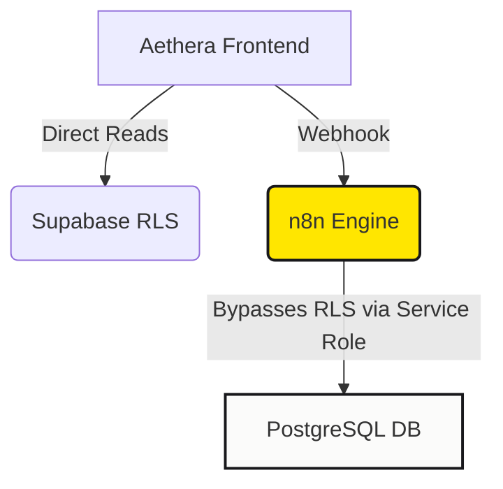
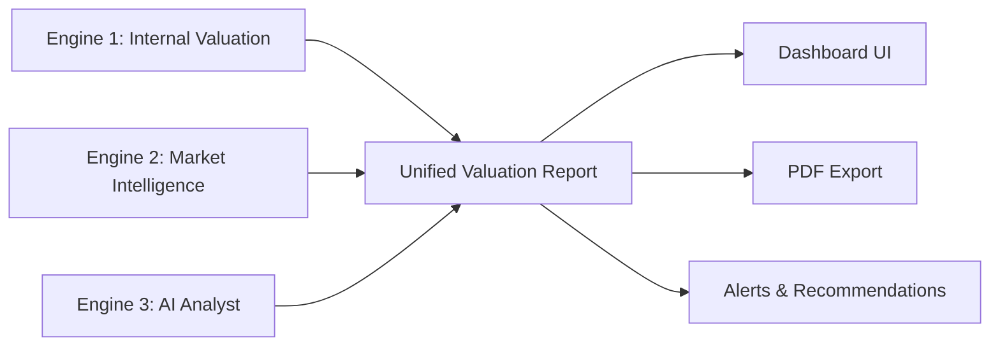
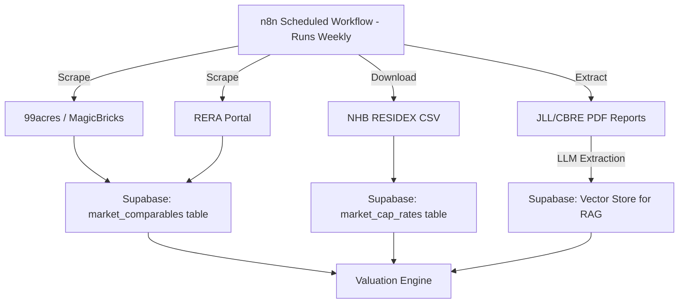

# Aethera Enterprise Telemetry Blueprint

## Architectural Audit: Prototype vs. Production-Grade Asset Intelligence

To scale **Aethera** from a highly automated CRM prototype to a multi-billion dollar enterprise "System of Record" that General Partners (GPs) can confidently open in front of institutional Limited Partners (LPs), we must perform a brutal engineering audit. 

Below is an honest evaluation of where our software stands today, how it compares to legacy and modern competitors, and the exact architectural blueprint required to make Aethera a bulletproof market leader.

---

## 1. The Competitor Landscape: Yardi, MRI, Cherre, and VTS

To build a category-defining real estate platform, we must understand the strengths and weaknesses of the existing giants:

### Legacy Giants (Yardi Voyager, MRI Software)
*   **The Trap:** Yardi and MRI are the undisputed database "systems of record" for 80% of global institutional portfolios. They have deep, GAAP-compliant **Double-Entry General Ledger accounting**, automated bank reconciliation (ACH/NACHA clearinghouses), and historical leasing tables.
*   **The Flaw:** They are architectural dinosaurs built on legacy SQL Server/Oracle stacks with clunky, 1990s-style interfaces. Implementing automated AI workflows, parsing leases with LLMs, or building live WhatsApp lead routers on top of Yardi is an integration nightmare. They are closed ecosystems.
*   **Aethera's Advantage:** We are already **5 years ahead** of Yardi in AI-native automation, unstructured document indexing (RAG), and conversational workflows.

### Modern Intelligence Layers (Cherre, VTS)
*   **VTS:** The gold standard for commercial leasing pipelines. It is highly optimized for front-office workflow—showing brokers exactly which spaces are vacant and managing viewing pipelines. However, it lacks deep back-office accounting and invoice auto-matching.
*   **Cherre:** A pure real estate data warehousing and ETL engine. It connects private property data with public spatial, tax, demographic, and climate datasets (like municipal GIS and tax rolls) into a single Snowflake or BigQuery warehouse. It is highly analytical but doesn't manage active back-office operations.

---

## 2. Honest Audit of Aethera's Current Database & Logic

### The Advanced Elements (Production-Ready)
1.  **Row-Level Security (RLS) Multi-Tenancy:** Our schema enforces strict RLS policies on all tables, isolating data at the PostgreSQL engine level by checking the `user_uid` through `team_members`. This is highly robust and prevents cross-tenant data leaks.
2.  **Hybrid Authority-Based RAG:** Segmenting documents into separate Qdrant collections (e.g., RERA regulations vs. local court orders vs. private leases) and applying Category RRF weighting ensures that high-authority data always ranks highest.
3.  **Autonomous Event-Driven Pipelines:** Offloading heavy document extraction (LlamaParse) and WhatsApp CRM scoring to n8n webhooks keeps the web application highly responsive.

### The "Toy-Level" Gaps (Must Be Upgraded)
While our database schema is comprehensive, several critical patterns are keeping it at a "toy-level" standard:



### Gap A: Missing Double-Entry Financial Telemetry
*   **Current Setup:** Our `rent_payments` and `invoices` tables are simple relational flat lists. We record `amount_due`, `amount_paid`, and `status`. 
*   **Why it's "Toy":** You cannot run a GAAP-audited, institutional real estate fund on flat lists. If an LP asks for a balance sheet, an aging accounts receivable ledger, or an accrual-basis income statement, our database cannot calculate it.
*   **Production Fix:** Implement a classic **double-entry ledger schema** (chart of accounts, debit/credit journal transactions, and ledger entries) mapped directly to property and tenant objects.

### Gap B: Implicit Webhook Trust (Vulnerability)
*   **Current Setup:** n8n acts as the background operational engine. It uses the `SUPABASE_SERVICE_ROLE_KEY` to read and write data, bypassing RLS.
*   **Why it's "Toy":** If our n8n endpoint receives a payload from WhatsApp or email, it blindly accepts the data and updates Supabase. If an attacker mimics an n8n webhook call, they can write arbitrary values (e.g., set an invoice to approved or inject a fake lease).
*   **Production Fix:** Restrict all webhook API routes in Next.js using a strong **Bearer Webhook Secret** signature validation and validate incoming payloads using strict **Zod schemas** before database interaction.

### Gap C: Loose JSONB Columns without Constraints
*   **Current Setup:** We use `leads.whatsapp_thread` and `invoices.line_items` as JSONB columns to enjoy unstructured flexibility.
*   **Why it's "Toy":** A typo in our n8n automation can write a malformed JSON object to these columns, corrupting the database state and crashing the Next.js frontend during render.
*   **Production Fix:** Implement PostgreSQL check constraints or utilize Zod validation on the API side to guarantee that all JSONB structures adhere to a strict interface contract.

---

## 3. The Enterprise-Grade Upgrade Blueprint

To convert Aethera into a secure, institutional-grade commercial platform, we must execute a two-phased upgrade:

```
                  ┌───────────────────────────────┐
                  │   Phase 1: GAAP Accounting   │
                  │   - Double-Entry Ledgers      │
                  │   - Accrual Journal Entries   │
                  └───────────────┬───────────────┘
                                  │
                                  ▼
                  ┌───────────────────────────────┐
                  │   Phase 2: Data Safeguards    │
                  │   - Zod Payload Validation    │
                  │   - Bearer Webhook Secrets    │
                  └───────────────────────────────┘
```

### Phase 1: Institutional Accounting Ledger Schema
Introduce three new tables to handle double-entry transactions:

```sql
-- Chart of Accounts
CREATE TABLE accounts (
  id              UUID PRIMARY KEY DEFAULT gen_random_uuid(),
  organization_id UUID REFERENCES organizations(id) ON DELETE CASCADE,
  code            TEXT NOT NULL, -- e.g., '1200' (AR), '4100' (Rent Revenue)
  name            TEXT NOT NULL,
  type            TEXT NOT NULL CHECK (type IN ('asset', 'liability', 'equity', 'revenue', 'expense')),
  created_at      TIMESTAMPTZ DEFAULT now()
);

-- Transaction Journals
CREATE TABLE journal_entries (
  id              UUID PRIMARY KEY DEFAULT gen_random_uuid(),
  organization_id UUID REFERENCES organizations(id) ON DELETE CASCADE,
  posted_at       TIMESTAMPTZ NOT NULL DEFAULT now(),
  description     TEXT,
  created_at      TIMESTAMPTZ DEFAULT now()
);

-- Individual Ledger Line Items (Must sum to 0 per transaction)
CREATE TABLE ledger_lines (
  id              UUID PRIMARY KEY DEFAULT gen_random_uuid(),
  journal_entry_id UUID REFERENCES journal_entries(id) ON DELETE CASCADE,
  account_id      UUID REFERENCES accounts(id) ON DELETE RESTRICT,
  debit           NUMERIC(12,2) DEFAULT 0,
  credit          NUMERIC(12,2) DEFAULT 0,
  CONSTRAINT check_debit_credit CHECK (
    (debit > 0 AND credit = 0) OR (debit = 0 AND credit > 0)
  )
);
```

### Phase 2: Webhook Guarding & Strict API Validation
All backend API routes receiving automated updates from n8n, WhatsApp, or payment systems must implement:
1.  **HMAC/Bearer Token Verification:** Block all requests that lack a verified system token.
2.  **Strict Zod Schema Matching:** Filter every single incoming parameter to prevent SQL injections or malformed object structures.

```typescript
// Example: app/api/webhooks/invoices/route.ts
import { z } from 'zod';
import { createClient } from '@supabase/supabase-js';

const invoiceWebhookSchema = z.object({
  invoice_id: z.string().uuid(),
  total_amount: z.number().positive(),
  vendor_id: z.string().uuid(),
  line_items: z.array(z.object({
    description: z.string(),
    amount: z.number().positive()
  }))
});

export async function POST(req: Request) {
  // 1. Guard check
  const authHeader = req.headers.get('authorization');
  if (authHeader !== `Bearer ${process.env.INTERNAL_WEBHOOK_SECRET}`) {
    return new Response('Unauthorized', { status: 401 });
  }

  // 2. Strict Zod parsing
  const rawBody = await req.json();
  const parsed = invoiceWebhookSchema.safeParse(rawBody);
  if (!parsed.success) {
    return new Response(JSON.stringify(parsed.error), { status: 400 });
  }

  // 3. Securely execute write
  const supabase = createClient(process.env.SUPABASE_URL!, process.env.SUPABASE_SERVICE_ROLE_KEY!);
  const { data, error } = await supabase
    .from('invoices')
    .update({ 
      total_amount: parsed.data.total_amount,
      line_items: parsed.data.line_items
    })
    .eq('id', parsed.data.invoice_id);

  return new Response('Success', { status: 200 });
}
```

---

## 4. Conclusion & Strategic Recommendation

Is Aethera a "toy" right now? **No, not on the front end or in its AI execution.** Our hybrid RAG indexing, LlamaParse automation, and scoring algorithms are superior to MRI and Yardi, which charge millions for clunky, manual database searches. 

However, Aethera is **currently missing the institutional financial spine** required to manage actual cash and satisfy GP/LP compliance audits. 

### My Recommendation:
1.  **Keep the current Supabase + n8n automation for speed and AI.**
2.  **Immediately upgrade our ledger schema** to support true GAAP double-entry ledger lines.
3.  **Execute the advanced webhook protection** pattern across our API endpoints to eliminate vulnerabilities and satisfy enterprise penetration testing.

This upgrade will position Aethera not just as a "clever property assistant," but as an un-assailable, high-fidelity real estate telemetry engine.


---

# Automated Property Valuation & Market Analysis — Implementation Plan

> [!IMPORTANT]
> This is not a toy feature. This is the core differentiator that transforms Aethera from "property management software" into an **investment intelligence platform**. No competitor in the Indian PropTech market does this natively.

---

## The Big Picture: What Are We Building?

A system that answers the question every property owner asks but no Indian PropTech tool can answer:

> **"What is my property actually worth right now, and what should I charge for rent?"**

We are building 3 interconnected engines:



| Engine | What It Does | Data Type |
|--------|-------------|-----------|
| **Engine 1: Internal Valuation** | Calculates property value from YOUR OWN data (rent rolls, maintenance costs, occupancy history) | **SQL** — structured, relational |
| **Engine 2: Market Intelligence** | Ingests external market data (comparable sales, price indices, neighborhood trends) | **SQL + Vector** — structured + semantic search |
| **Engine 3: AI Analyst** | Uses an LLM to synthesize internal + external data into human-readable insights and recommendations | **Vector (RAG)** — retrieval-augmented generation |

---

## Engine 1: Internal Valuation (SQL Data)

This uses data you ALREADY have in your database. No external APIs needed.

### Valuation Method: The Income Approach (Cap Rate Method)

This is the industry-standard method used by every institutional investor to value rental properties.

**Formula:**
```
Property Value = Net Operating Income (NOI) / Capitalization Rate (Cap Rate)
```

**Where:**
- **NOI** = Total Annual Rent Collected − Total Annual Operating Expenses (maintenance, vendor invoices, management fees)
- **Cap Rate** = The market's expected return rate for similar properties (e.g., 5% for premium Hyderabad, 8% for tier-2 cities)

### What Data We Already Have (from your current schema):

| Data Point | Source Table | Column |
|-----------|-------------|--------|
| Monthly Rent per Unit | `units` | `rent_amount` |
| Actual Rent Collected | `rent_payments` | `amount_paid` |
| Lease Escalation % | `leases` | `escalation_percent` |
| Maintenance Costs | `maintenance_tickets` | `actual_cost` |
| Vendor Invoice Costs | `invoices` | `total_amount` |
| Occupancy Status | `units` | `status` (occupied/vacant) |
| Property Location | `properties` | `city`, `state`, `pincode` |
| Unit Size | `units` | `area_sqft` |
| Year Built | `properties` | `year_built` |

### New Tables Needed:

```sql
-- 1. Store computed valuations over time (SQL — structured)
CREATE TABLE property_valuations (
  id UUID PRIMARY KEY DEFAULT gen_random_uuid(),
  organization_id UUID REFERENCES organizations(id),
  property_id UUID REFERENCES properties(id),
  
  -- Income Approach
  gross_rental_income NUMERIC,        -- Total annual rent if 100% occupied
  effective_gross_income NUMERIC,     -- Actual rent collected (minus vacancy)
  total_operating_expenses NUMERIC,   -- Maintenance + Invoices + Management fee
  net_operating_income NUMERIC,       -- EGI - Expenses
  cap_rate NUMERIC,                   -- Market cap rate used
  income_valuation NUMERIC,           -- NOI / Cap Rate
  
  -- Comparable Approach
  comparable_valuation NUMERIC,       -- From market comps
  comparable_count INTEGER,           -- How many comps were used
  
  -- Final Blended
  estimated_value NUMERIC,            -- Weighted average of both methods
  confidence_score NUMERIC,           -- 0-100, how confident the model is
  value_per_sqft NUMERIC,             -- For easy comparison
  
  -- Rent Analysis
  current_avg_rent NUMERIC,           -- Current average rent/unit
  market_avg_rent NUMERIC,            -- What the market charges
  rent_gap_percent NUMERIC,           -- % above or below market
  recommended_rent NUMERIC,           -- What you SHOULD charge
  
  -- Metadata
  valuation_method TEXT DEFAULT 'blended',
  data_sources JSONB,                 -- Which sources contributed
  generated_by TEXT DEFAULT 'system', -- 'system' or 'manual'
  notes TEXT,
  created_at TIMESTAMPTZ DEFAULT now()
);

-- 2. Store cap rate benchmarks by city/area (SQL — structured)
CREATE TABLE market_cap_rates (
  id UUID PRIMARY KEY DEFAULT gen_random_uuid(),
  city TEXT NOT NULL,
  state TEXT,
  pincode TEXT,
  property_type TEXT,                 -- residential, commercial, mixed
  cap_rate NUMERIC NOT NULL,          -- e.g., 5.2
  source TEXT,                        -- 'jll_report', 'manual', 'scraped'
  report_date DATE,
  created_at TIMESTAMPTZ DEFAULT now()
);

-- 3. Store comparable sales/rental data (SQL — structured)
CREATE TABLE market_comparables (
  id UUID PRIMARY KEY DEFAULT gen_random_uuid(),
  city TEXT NOT NULL,
  state TEXT,
  pincode TEXT,
  locality TEXT,                      -- e.g., "Banjara Hills", "Koramangala"
  property_type TEXT,
  area_sqft NUMERIC,
  sale_price NUMERIC,                 -- If sold
  rent_per_month NUMERIC,             -- If rented
  price_per_sqft NUMERIC,
  bedrooms INTEGER,
  floor_number INTEGER,
  year_built INTEGER,
  amenities TEXT[],
  data_source TEXT,                   -- '99acres', 'magicbricks', 'manual', 'govt_registry'
  listing_date DATE,
  transaction_date DATE,
  raw_data JSONB,                     -- Store the original scraped data
  created_at TIMESTAMPTZ DEFAULT now()
);
```

### Supabase RPC Function for NOI Calculation:

Instead of downloading all data to the browser (the toy way), we compute everything server-side:

```sql
CREATE OR REPLACE FUNCTION calculate_property_noi(p_property_id UUID, p_org_id UUID)
RETURNS JSONB AS $$
DECLARE
  result JSONB;
  v_gross_income NUMERIC;
  v_vacancy_loss NUMERIC;
  v_operating_expenses NUMERIC;
  v_noi NUMERIC;
  v_total_units INTEGER;
  v_occupied_units INTEGER;
BEGIN
  -- Gross Potential Rent (all units at full rent, annualized)
  SELECT COALESCE(SUM(rent_amount * 12), 0), COUNT(*)
  INTO v_gross_income, v_total_units
  FROM units WHERE property_id = p_property_id AND organization_id = p_org_id;

  -- Occupied units
  SELECT COUNT(*) INTO v_occupied_units
  FROM units WHERE property_id = p_property_id AND organization_id = p_org_id AND status = 'occupied';

  -- Vacancy loss
  v_vacancy_loss := v_gross_income * (1 - (v_occupied_units::NUMERIC / GREATEST(v_total_units, 1)));

  -- Operating Expenses (maintenance + invoices from last 12 months)
  SELECT COALESCE(SUM(actual_cost), 0) INTO v_operating_expenses
  FROM maintenance_tickets
  WHERE property_id = p_property_id
    AND organization_id = p_org_id
    AND completed_at >= NOW() - INTERVAL '12 months';

  -- Add vendor invoices
  v_operating_expenses := v_operating_expenses + COALESCE((
    SELECT SUM(total_amount) FROM invoices
    WHERE property_id = p_property_id
      AND organization_id = p_org_id
      AND status IN ('approved', 'paid')
      AND created_at >= NOW() - INTERVAL '12 months'
  ), 0);

  v_noi := (v_gross_income - v_vacancy_loss) - v_operating_expenses;

  result := jsonb_build_object(
    'gross_potential_income', v_gross_income,
    'vacancy_loss', v_vacancy_loss,
    'effective_gross_income', v_gross_income - v_vacancy_loss,
    'operating_expenses', v_operating_expenses,
    'noi', v_noi,
    'total_units', v_total_units,
    'occupied_units', v_occupied_units,
    'occupancy_rate', ROUND((v_occupied_units::NUMERIC / GREATEST(v_total_units, 1)) * 100, 1),
    'expense_ratio', CASE WHEN v_gross_income > 0 
      THEN ROUND((v_operating_expenses / v_gross_income) * 100, 1) ELSE 0 END
  );

  RETURN result;
END;
$$ LANGUAGE plpgsql SECURITY DEFINER;
```

---

## Engine 2: Market Intelligence (SQL + Vector Data)

This is where external data comes in. We need to know what the MARKET says properties in a given area are worth.

### Data Sources (Indian Market):

| Source | Data Type | How to Get It | Cost |
|--------|-----------|---------------|------|
| **99acres / MagicBricks** | Rental listings, sale prices | Web scraping via n8n + Bright Data proxy | Free (scraping) or ₹5K/mo (API) |
| **NHB RESIDEX** (National Housing Bank) | Official house price index by city | Public API / CSV download | Free |
| **RERA Portal** | Registered project prices, completion status | State-wise public data | Free |
| **Circle Rates** (Govt. Stamp Duty) | Minimum govt. valuation per sq.ft by locality | State revenue dept. websites | Free |
| **JLL / Knight Frank / CBRE Reports** | Quarterly market reports with cap rates, yield data | PDF download → AI extraction | Free (public reports) |
| **Google Maps / OSM** | Distance to metro, hospitals, schools (livability score) | Google Places API | Free tier (up to 10K requests/mo) |

### How External Data Flows In:



### Vector Data: When and Why?

> [!NOTE]
> **SQL is for numbers. Vectors are for meaning.**

| Use SQL When... | Use Vectors When... |
|-----------------|---------------------|
| Counting units, summing rent, calculating NOI | Searching market reports for "What is the rental yield trend in Banjara Hills?" |
| Storing comparable sale prices | Storing chunks of JLL/CBRE PDF reports for semantic retrieval |
| Querying "show me all 2BHK listings in 500032 under ₹25K" | Querying "What are analysts saying about Hyderabad commercial market outlook?" |
| Aggregating historical rent trends | Finding similar property descriptions across listings |

### Supabase Vector Store Setup:

```sql
-- Enable the pgvector extension (already available on Supabase)
CREATE EXTENSION IF NOT EXISTS vector;

-- Store market report chunks for RAG (AI Analyst)
CREATE TABLE market_intelligence_chunks (
  id UUID PRIMARY KEY DEFAULT gen_random_uuid(),
  content TEXT NOT NULL,              -- The text chunk from a report
  embedding VECTOR(1536),             -- OpenAI text-embedding-3-small
  source_type TEXT,                   -- 'jll_report', 'cbre_report', 'news_article', 'govt_data'
  source_name TEXT,                   -- 'JLL Q1 2026 India Report'
  source_url TEXT,
  city TEXT,
  property_type TEXT,
  report_date DATE,
  metadata JSONB,                     -- Any extra structured data from the chunk
  created_at TIMESTAMPTZ DEFAULT now()
);

-- Create an index for fast similarity search
CREATE INDEX ON market_intelligence_chunks 
  USING ivfflat (embedding vector_cosine_ops) WITH (lists = 100);
```

---

## Engine 3: AI Analyst (RAG — Retrieval Augmented Generation)

This is the "brain" that takes all the numbers from Engine 1 and all the market context from Engine 2 and produces a human-readable valuation report.

### Tech Stack:

| Component | Technology | Why |
|-----------|-----------|-----|
| **LLM** | OpenAI GPT-4o or Claude 3.5 Sonnet | Best reasoning for financial analysis |
| **Embeddings** | OpenAI `text-embedding-3-small` | Cost-effective, 1536 dimensions, works perfectly with pgvector |
| **Vector DB** | Supabase pgvector (already in your stack) | No new infrastructure needed |
| **Orchestration** | Supabase Edge Function or n8n | Connects everything together |
| **Output** | Structured JSON → rendered in Next.js | Clean, auditable |

### How the AI Analyst Works:

```
Step 1: User clicks "Generate Valuation" for a property
Step 2: Edge Function calls calculate_property_noi() → gets internal financials
Step 3: Edge Function queries market_comparables for nearby properties → gets comps
Step 4: Edge Function does a vector similarity search on market_intelligence_chunks 
        → retrieves relevant market context ("JLL says Hyderabad cap rates are 5.2%")
Step 5: All 3 data sources are assembled into a prompt for the LLM
Step 6: LLM generates a structured JSON valuation report
Step 7: Report is saved to property_valuations table
Step 8: Frontend renders the report with charts
```

### Example LLM Prompt (sent to GPT-4o):

```
You are a senior real estate valuation analyst. Generate a property valuation report.

INTERNAL DATA (from the owner's portfolio):
- Property: Sunshine Residency, Banjara Hills, Hyderabad
- Total Units: 12 | Occupied: 10 (83.3%)
- Gross Potential Income: ₹36,00,000/yr
- Effective Gross Income: ₹30,00,000/yr
- Operating Expenses: ₹4,20,000/yr
- Net Operating Income (NOI): ₹25,80,000/yr
- Current Avg Rent: ₹25,000/unit/mo

MARKET COMPARABLES (from 99acres/MagicBricks):
- 2BHK in Banjara Hills (1100 sqft): ₹28,000/mo avg rent
- 2BHK in Jubilee Hills (1200 sqft): ₹32,000/mo avg rent  
- Recent sale: 1100 sqft flat in Road No. 12: ₹1.1 Cr (₹10,000/sqft)

MARKET INTELLIGENCE (from JLL/CBRE reports):
- "Hyderabad residential rental yields averaged 3.8-4.2% in Q1 2026"
- "Banjara Hills cap rates compressed to 4.5% due to infrastructure upgrades"
- "NHB RESIDEX shows 8.2% YoY price appreciation in Hyderabad"

OUTPUT FORMAT: Return a JSON object with these fields:
{
  "income_valuation": number,
  "comparable_valuation": number,
  "blended_valuation": number,
  "confidence_score": 0-100,
  "current_rent_vs_market": "below_market" | "at_market" | "above_market",
  "rent_gap_percent": number,
  "recommended_rent": number,
  "key_insights": string[],
  "risks": string[],
  "opportunities": string[]
}
```

---

## Complete Tech Stack Summary

| Layer | Technology | Purpose |
|-------|-----------|---------|
| **Database (Structured)** | Supabase PostgreSQL | Properties, units, rent payments, valuations, comparables, cap rates |
| **Database (Vector)** | Supabase pgvector | Market report chunks, semantic search for AI analyst |
| **Server-Side Compute** | Supabase RPC (PL/pgSQL) | NOI calculation, aggregations — never done in the browser |
| **External Data Pipeline** | n8n (scheduled workflows) | Weekly scraping of 99acres, NHB RESIDEX, RERA, JLL PDFs |
| **Embeddings** | OpenAI `text-embedding-3-small` | Convert market reports into vectors for similarity search |
| **AI Reasoning** | GPT-4o / Claude Sonnet via Edge Function | Generate valuation reports from combined data |
| **API Layer** | Next.js API Routes (with Zod validation) | Serve valuation data to frontend securely |
| **Frontend** | Next.js Server Components + Recharts | Render valuation dashboards, trend charts, comp tables |
| **Export** | html2canvas + jsPDF (client-side) | Download valuation reports as PDF |
| **Monitoring** | Supabase Audit Log | Track every valuation generated, by whom, when |

---

## Implementation Phases

### Phase 1: Foundation (Week 1-2)
- [ ] Create the 3 new database tables (migration)
- [ ] Write the `calculate_property_noi()` RPC function
- [ ] Seed `market_cap_rates` with Indian city data (Hyderabad, Bangalore, Mumbai, Delhi, Chennai, Pune)
- [ ] Build the basic Valuation Dashboard page (Server Component)

### Phase 2: Market Data Pipeline (Week 3-4)
- [ ] Set up n8n workflow to scrape 99acres listings weekly
- [ ] Ingest NHB RESIDEX data (CSV → `market_cap_rates`)
- [ ] Enable pgvector extension on Supabase
- [ ] Build the embedding pipeline for JLL/CBRE reports
- [ ] Create the `market_intelligence_chunks` table with vector index

### Phase 3: AI Analyst (Week 5-6)
- [ ] Build the Edge Function that orchestrates valuation generation
- [ ] Implement RAG: vector search → context assembly → LLM prompt
- [ ] Save generated valuations to `property_valuations`
- [ ] Build the valuation report UI with charts, comps table, and AI insights
- [ ] Add PDF export for the valuation report

### Phase 4: Alerts & Automation (Week 7-8)
- [ ] Auto-generate valuations monthly (n8n cron)
- [ ] Alert when market rent exceeds current rent by >15% ("You're leaving money on the table")
- [ ] Alert when NOI drops >10% month-over-month
- [ ] Historical valuation trend chart (track property value over time)
- [ ] Comparative analysis across portfolio ("Which property is underperforming?")

---

> [!TIP]
> **The killer insight:** Your competitors (NoBroker, Square Yards) help people FIND properties. Aethera will be the only platform that tells owners what their property is WORTH and what they SHOULD be charging. This is the "God Mode" for asset managers.
