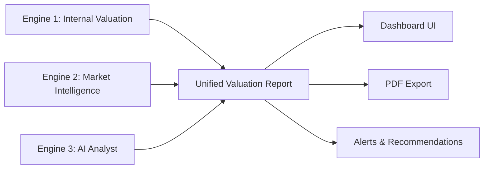
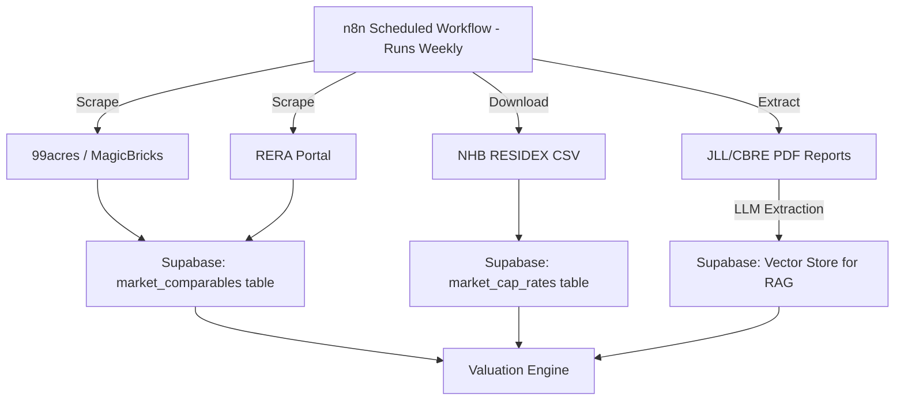

# Automated Property Valuation & Market Analysis — Implementation Plan

> [!IMPORTANT]
> This is not a toy feature. This is the core differentiator that transforms Aethera from "property management software" into an **investment intelligence platform**. No competitor in the Indian PropTech market does this natively.

---

## The Big Picture: What Are We Building?

A system that answers the question every property owner asks but no Indian PropTech tool can answer:

> **"What is my property actually worth right now, and what should I charge for rent?"**

We are building 3 interconnected engines:



| Engine | What It Does | Data Type |
|--------|-------------|-----------|
| **Engine 1: Internal Valuation** | Calculates property value from YOUR OWN data (rent rolls, maintenance costs, occupancy history) | **SQL** — structured, relational |
| **Engine 2: Market Intelligence** | Ingests external market data (comparable sales, price indices, neighborhood trends) | **SQL + Vector** — structured + semantic search |
| **Engine 3: AI Analyst** | Uses an LLM to synthesize internal + external data into human-readable insights and recommendations | **Vector (RAG)** — retrieval-augmented generation |

---

## Engine 1: Internal Valuation (SQL Data)

This uses data you ALREADY have in your database. No external APIs needed.

### Valuation Method: The Income Approach (Cap Rate Method)

This is the industry-standard method used by every institutional investor to value rental properties.

**Formula:**
```
Property Value = Net Operating Income (NOI) / Capitalization Rate (Cap Rate)
```

**Where:**
- **NOI** = Total Annual Rent Collected − Total Annual Operating Expenses (maintenance, vendor invoices, management fees)
- **Cap Rate** = The market's expected return rate for similar properties (e.g., 5% for premium Hyderabad, 8% for tier-2 cities)

### What Data We Already Have (from your current schema):

| Data Point | Source Table | Column |
|-----------|-------------|--------|
| Monthly Rent per Unit | `units` | `rent_amount` |
| Actual Rent Collected | `rent_payments` | `amount_paid` |
| Lease Escalation % | `leases` | `escalation_percent` |
| Maintenance Costs | `maintenance_tickets` | `actual_cost` |
| Vendor Invoice Costs | `invoices` | `total_amount` |
| Occupancy Status | `units` | `status` (occupied/vacant) |
| Property Location | `properties` | `city`, `state`, `pincode` |
| Unit Size | `units` | `area_sqft` |
| Year Built | `properties` | `year_built` |

### New Tables Needed:

```sql
-- 1. Store computed valuations over time (SQL — structured)
CREATE TABLE property_valuations (
  id UUID PRIMARY KEY DEFAULT gen_random_uuid(),
  organization_id UUID REFERENCES organizations(id),
  property_id UUID REFERENCES properties(id),
  
  -- Income Approach
  gross_rental_income NUMERIC,        -- Total annual rent if 100% occupied
  effective_gross_income NUMERIC,     -- Actual rent collected (minus vacancy)
  total_operating_expenses NUMERIC,   -- Maintenance + Invoices + Management fee
  net_operating_income NUMERIC,       -- EGI - Expenses
  cap_rate NUMERIC,                   -- Market cap rate used
  income_valuation NUMERIC,           -- NOI / Cap Rate
  
  -- Comparable Approach
  comparable_valuation NUMERIC,       -- From market comps
  comparable_count INTEGER,           -- How many comps were used
  
  -- Final Blended
  estimated_value NUMERIC,            -- Weighted average of both methods
  confidence_score NUMERIC,           -- 0-100, how confident the model is
  value_per_sqft NUMERIC,             -- For easy comparison
  
  -- Rent Analysis
  current_avg_rent NUMERIC,           -- Current average rent/unit
  market_avg_rent NUMERIC,            -- What the market charges
  rent_gap_percent NUMERIC,           -- % above or below market
  recommended_rent NUMERIC,           -- What you SHOULD charge
  
  -- Metadata
  valuation_method TEXT DEFAULT 'blended',
  data_sources JSONB,                 -- Which sources contributed
  generated_by TEXT DEFAULT 'system', -- 'system' or 'manual'
  notes TEXT,
  created_at TIMESTAMPTZ DEFAULT now()
);

-- 2. Store cap rate benchmarks by city/area (SQL — structured)
CREATE TABLE market_cap_rates (
  id UUID PRIMARY KEY DEFAULT gen_random_uuid(),
  city TEXT NOT NULL,
  state TEXT,
  pincode TEXT,
  property_type TEXT,                 -- residential, commercial, mixed
  cap_rate NUMERIC NOT NULL,          -- e.g., 5.2
  source TEXT,                        -- 'jll_report', 'manual', 'scraped'
  report_date DATE,
  created_at TIMESTAMPTZ DEFAULT now()
);

-- 3. Store comparable sales/rental data (SQL — structured)
CREATE TABLE market_comparables (
  id UUID PRIMARY KEY DEFAULT gen_random_uuid(),
  city TEXT NOT NULL,
  state TEXT,
  pincode TEXT,
  locality TEXT,                      -- e.g., "Banjara Hills", "Koramangala"
  property_type TEXT,
  area_sqft NUMERIC,
  sale_price NUMERIC,                 -- If sold
  rent_per_month NUMERIC,             -- If rented
  price_per_sqft NUMERIC,
  bedrooms INTEGER,
  floor_number INTEGER,
  year_built INTEGER,
  amenities TEXT[],
  data_source TEXT,                   -- '99acres', 'magicbricks', 'manual', 'govt_registry'
  listing_date DATE,
  transaction_date DATE,
  raw_data JSONB,                     -- Store the original scraped data
  created_at TIMESTAMPTZ DEFAULT now()
);
```

### Supabase RPC Function for NOI Calculation:

Instead of downloading all data to the browser (the toy way), we compute everything server-side:

```sql
CREATE OR REPLACE FUNCTION calculate_property_noi(p_property_id UUID, p_org_id UUID)
RETURNS JSONB AS $$
DECLARE
  result JSONB;
  v_gross_income NUMERIC;
  v_vacancy_loss NUMERIC;
  v_operating_expenses NUMERIC;
  v_noi NUMERIC;
  v_total_units INTEGER;
  v_occupied_units INTEGER;
BEGIN
  -- Gross Potential Rent (all units at full rent, annualized)
  SELECT COALESCE(SUM(rent_amount * 12), 0), COUNT(*)
  INTO v_gross_income, v_total_units
  FROM units WHERE property_id = p_property_id AND organization_id = p_org_id;

  -- Occupied units
  SELECT COUNT(*) INTO v_occupied_units
  FROM units WHERE property_id = p_property_id AND organization_id = p_org_id AND status = 'occupied';

  -- Vacancy loss
  v_vacancy_loss := v_gross_income * (1 - (v_occupied_units::NUMERIC / GREATEST(v_total_units, 1)));

  -- Operating Expenses (maintenance + invoices from last 12 months)
  SELECT COALESCE(SUM(actual_cost), 0) INTO v_operating_expenses
  FROM maintenance_tickets
  WHERE property_id = p_property_id
    AND organization_id = p_org_id
    AND completed_at >= NOW() - INTERVAL '12 months';

  -- Add vendor invoices
  v_operating_expenses := v_operating_expenses + COALESCE((
    SELECT SUM(total_amount) FROM invoices
    WHERE property_id = p_property_id
      AND organization_id = p_org_id
      AND status IN ('approved', 'paid')
      AND created_at >= NOW() - INTERVAL '12 months'
  ), 0);

  v_noi := (v_gross_income - v_vacancy_loss) - v_operating_expenses;

  result := jsonb_build_object(
    'gross_potential_income', v_gross_income,
    'vacancy_loss', v_vacancy_loss,
    'effective_gross_income', v_gross_income - v_vacancy_loss,
    'operating_expenses', v_operating_expenses,
    'noi', v_noi,
    'total_units', v_total_units,
    'occupied_units', v_occupied_units,
    'occupancy_rate', ROUND((v_occupied_units::NUMERIC / GREATEST(v_total_units, 1)) * 100, 1),
    'expense_ratio', CASE WHEN v_gross_income > 0 
      THEN ROUND((v_operating_expenses / v_gross_income) * 100, 1) ELSE 0 END
  );

  RETURN result;
END;
$$ LANGUAGE plpgsql SECURITY DEFINER;
```

---

## Engine 2: Market Intelligence (SQL + Vector Data)

This is where external data comes in. We need to know what the MARKET says properties in a given area are worth.

### Data Sources (Indian Market):

| Source | Data Type | How to Get It | Cost |
|--------|-----------|---------------|------|
| **99acres / MagicBricks** | Rental listings, sale prices | Web scraping via n8n + Bright Data proxy | Free (scraping) or ₹5K/mo (API) |
| **NHB RESIDEX** (National Housing Bank) | Official house price index by city | Public API / CSV download | Free |
| **RERA Portal** | Registered project prices, completion status | State-wise public data | Free |
| **Circle Rates** (Govt. Stamp Duty) | Minimum govt. valuation per sq.ft by locality | State revenue dept. websites | Free |
| **JLL / Knight Frank / CBRE Reports** | Quarterly market reports with cap rates, yield data | PDF download → AI extraction | Free (public reports) |
| **Google Maps / OSM** | Distance to metro, hospitals, schools (livability score) | Google Places API | Free tier (up to 10K requests/mo) |

### How External Data Flows In:



### Vector Data: When and Why?

> [!NOTE]
> **SQL is for numbers. Vectors are for meaning.**

| Use SQL When... | Use Vectors When... |
|-----------------|---------------------|
| Counting units, summing rent, calculating NOI | Searching market reports for "What is the rental yield trend in Banjara Hills?" |
| Storing comparable sale prices | Storing chunks of JLL/CBRE PDF reports for semantic retrieval |
| Querying "show me all 2BHK listings in 500032 under ₹25K" | Querying "What are analysts saying about Hyderabad commercial market outlook?" |
| Aggregating historical rent trends | Finding similar property descriptions across listings |

### Supabase Vector Store Setup:

```sql
-- Enable the pgvector extension (already available on Supabase)
CREATE EXTENSION IF NOT EXISTS vector;

-- Store market report chunks for RAG (AI Analyst)
CREATE TABLE market_intelligence_chunks (
  id UUID PRIMARY KEY DEFAULT gen_random_uuid(),
  content TEXT NOT NULL,              -- The text chunk from a report
  embedding VECTOR(1536),             -- OpenAI text-embedding-3-small
  source_type TEXT,                   -- 'jll_report', 'cbre_report', 'news_article', 'govt_data'
  source_name TEXT,                   -- 'JLL Q1 2026 India Report'
  source_url TEXT,
  city TEXT,
  property_type TEXT,
  report_date DATE,
  metadata JSONB,                     -- Any extra structured data from the chunk
  created_at TIMESTAMPTZ DEFAULT now()
);

-- Create an index for fast similarity search
CREATE INDEX ON market_intelligence_chunks 
  USING ivfflat (embedding vector_cosine_ops) WITH (lists = 100);
```

---

## Engine 3: AI Analyst (RAG — Retrieval Augmented Generation)

This is the "brain" that takes all the numbers from Engine 1 and all the market context from Engine 2 and produces a human-readable valuation report.

### Tech Stack:

| Component | Technology | Why |
|-----------|-----------|-----|
| **LLM** | OpenAI GPT-4o or Claude 3.5 Sonnet | Best reasoning for financial analysis |
| **Embeddings** | OpenAI `text-embedding-3-small` | Cost-effective, 1536 dimensions, works perfectly with pgvector |
| **Vector DB** | Supabase pgvector (already in your stack) | No new infrastructure needed |
| **Orchestration** | Supabase Edge Function or n8n | Connects everything together |
| **Output** | Structured JSON → rendered in Next.js | Clean, auditable |

### How the AI Analyst Works:

```
Step 1: User clicks "Generate Valuation" for a property
Step 2: Edge Function calls calculate_property_noi() → gets internal financials
Step 3: Edge Function queries market_comparables for nearby properties → gets comps
Step 4: Edge Function does a vector similarity search on market_intelligence_chunks 
        → retrieves relevant market context ("JLL says Hyderabad cap rates are 5.2%")
Step 5: All 3 data sources are assembled into a prompt for the LLM
Step 6: LLM generates a structured JSON valuation report
Step 7: Report is saved to property_valuations table
Step 8: Frontend renders the report with charts
```

### Example LLM Prompt (sent to GPT-4o):

```
You are a senior real estate valuation analyst. Generate a property valuation report.

INTERNAL DATA (from the owner's portfolio):
- Property: Sunshine Residency, Banjara Hills, Hyderabad
- Total Units: 12 | Occupied: 10 (83.3%)
- Gross Potential Income: ₹36,00,000/yr
- Effective Gross Income: ₹30,00,000/yr
- Operating Expenses: ₹4,20,000/yr
- Net Operating Income (NOI): ₹25,80,000/yr
- Current Avg Rent: ₹25,000/unit/mo

MARKET COMPARABLES (from 99acres/MagicBricks):
- 2BHK in Banjara Hills (1100 sqft): ₹28,000/mo avg rent
- 2BHK in Jubilee Hills (1200 sqft): ₹32,000/mo avg rent  
- Recent sale: 1100 sqft flat in Road No. 12: ₹1.1 Cr (₹10,000/sqft)

MARKET INTELLIGENCE (from JLL/CBRE reports):
- "Hyderabad residential rental yields averaged 3.8-4.2% in Q1 2026"
- "Banjara Hills cap rates compressed to 4.5% due to infrastructure upgrades"
- "NHB RESIDEX shows 8.2% YoY price appreciation in Hyderabad"

OUTPUT FORMAT: Return a JSON object with these fields:
{
  "income_valuation": number,
  "comparable_valuation": number,
  "blended_valuation": number,
  "confidence_score": 0-100,
  "current_rent_vs_market": "below_market" | "at_market" | "above_market",
  "rent_gap_percent": number,
  "recommended_rent": number,
  "key_insights": string[],
  "risks": string[],
  "opportunities": string[]
}
```

---

## Complete Tech Stack Summary

| Layer | Technology | Purpose |
|-------|-----------|---------|
| **Database (Structured)** | Supabase PostgreSQL | Properties, units, rent payments, valuations, comparables, cap rates |
| **Database (Vector)** | Supabase pgvector | Market report chunks, semantic search for AI analyst |
| **Server-Side Compute** | Supabase RPC (PL/pgSQL) | NOI calculation, aggregations — never done in the browser |
| **External Data Pipeline** | n8n (scheduled workflows) | Weekly scraping of 99acres, NHB RESIDEX, RERA, JLL PDFs |
| **Embeddings** | OpenAI `text-embedding-3-small` | Convert market reports into vectors for similarity search |
| **AI Reasoning** | GPT-4o / Claude Sonnet via Edge Function | Generate valuation reports from combined data |
| **API Layer** | Next.js API Routes (with Zod validation) | Serve valuation data to frontend securely |
| **Frontend** | Next.js Server Components + Recharts | Render valuation dashboards, trend charts, comp tables |
| **Export** | html2canvas + jsPDF (client-side) | Download valuation reports as PDF |
| **Monitoring** | Supabase Audit Log | Track every valuation generated, by whom, when |

---

## Implementation Phases

### Phase 1: Foundation (Week 1-2)
- [ ] Create the 3 new database tables (migration)
- [ ] Write the `calculate_property_noi()` RPC function
- [ ] Seed `market_cap_rates` with Indian city data (Hyderabad, Bangalore, Mumbai, Delhi, Chennai, Pune)
- [ ] Build the basic Valuation Dashboard page (Server Component)

### Phase 2: Market Data Pipeline (Week 3-4)
- [ ] Set up n8n workflow to scrape 99acres listings weekly
- [ ] Ingest NHB RESIDEX data (CSV → `market_cap_rates`)
- [ ] Enable pgvector extension on Supabase
- [ ] Build the embedding pipeline for JLL/CBRE reports
- [ ] Create the `market_intelligence_chunks` table with vector index

### Phase 3: AI Analyst (Week 5-6)
- [ ] Build the Edge Function that orchestrates valuation generation
- [ ] Implement RAG: vector search → context assembly → LLM prompt
- [ ] Save generated valuations to `property_valuations`
- [ ] Build the valuation report UI with charts, comps table, and AI insights
- [ ] Add PDF export for the valuation report

### Phase 4: Alerts & Automation (Week 7-8)
- [ ] Auto-generate valuations monthly (n8n cron)
- [ ] Alert when market rent exceeds current rent by >15% ("You're leaving money on the table")
- [ ] Alert when NOI drops >10% month-over-month
- [ ] Historical valuation trend chart (track property value over time)
- [ ] Comparative analysis across portfolio ("Which property is underperforming?")

---

> [!TIP]
> **The killer insight:** Your competitors (NoBroker, Square Yards) help people FIND properties. Aethera will be the only platform that tells owners what their property is WORTH and what they SHOULD be charging. This is the "God Mode" for asset managers.
